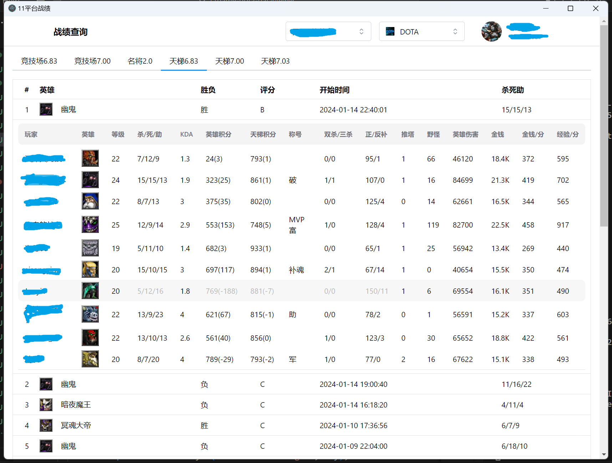

# 11平台 Dota 最近战绩查看工具

## 介绍

这是一个用于查看11平台 Dota 最近战绩的工具软件。你可以使用它来方便地查看玩家的游戏记录信息。

## 示例截图

12

## 功能特性

- 查看玩家最近的比赛记录
- 统计胜率和其他关键数据

## 安装

克隆并安装依赖:

```bash
git clone https://github.com/hohogpb/11game-dota-dataviewer.git your-project-name
cd your-project-name
npm install
```

## 开始开发

在 `dev` 环境下启动app:

```bash
npm start
```

## 打包

打包到本机平台:

```bash
npm run package
```

## License

MIT ©
